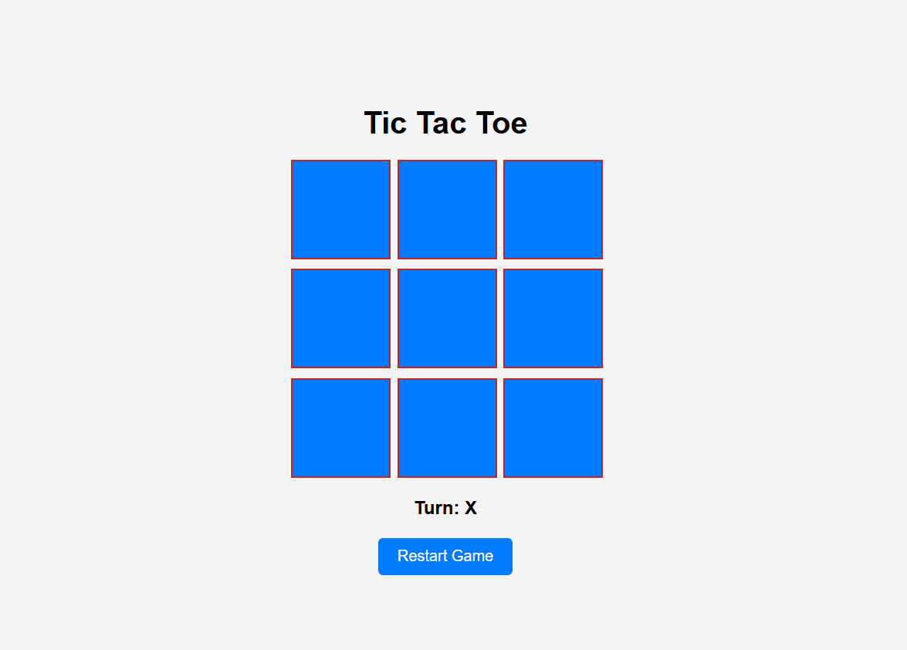
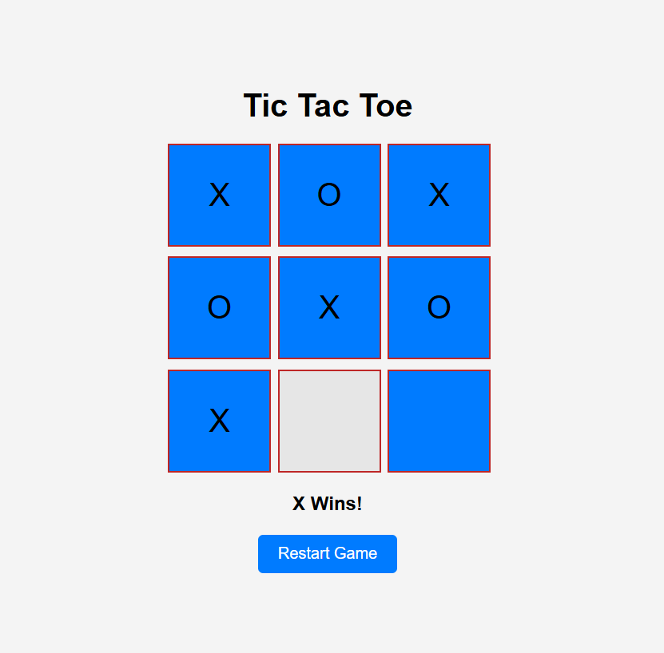
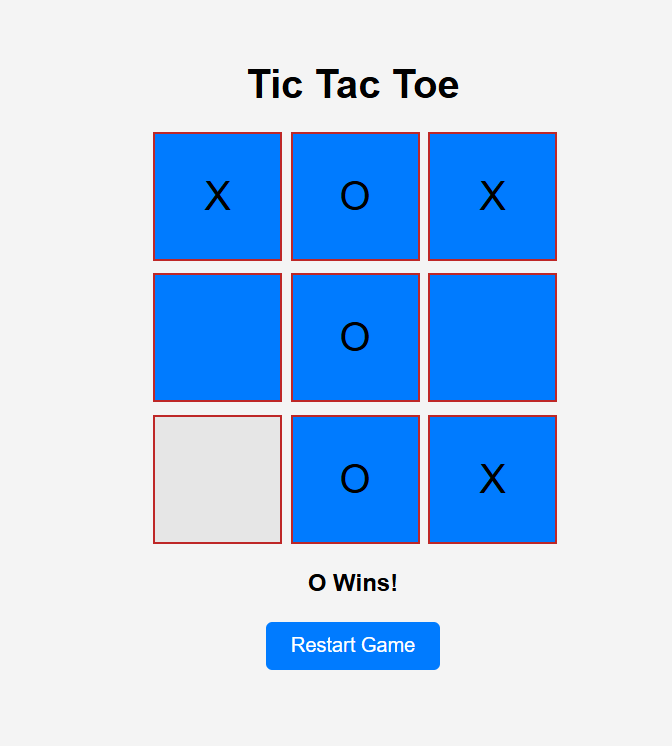
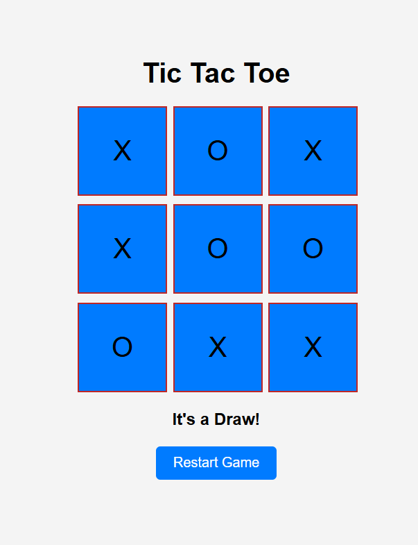
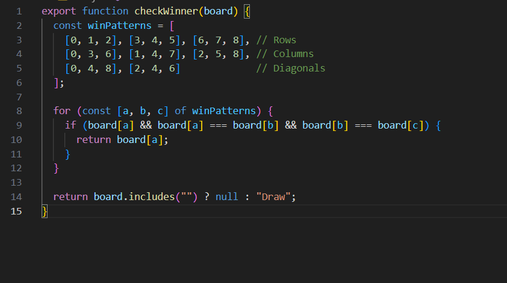

# Tic Tac Toe

> The **Tic Tac Toe** project provides a simple and engaging game that can be played by two players, either against each other or with an AI opponent. The game is designed to be user-friendly, featuring a clean layout with a 3x3 grid and basic gameplay mechanics.

- [Tic Tac Toe](#tic-tac-toe)
  - [General info](#general-info)
  - [Table of contents](#table-of-contents)
  - [Screenshots](#screenshots)
  - [Code Example](#code-example)
  - [Technologies](#technologies)
  - [Status](#status)
  - [Inspiration](#inspiration)
  - [Contact](#contact)

## General info

> This project meets the needs of its intended audience, providing an engaging, simple, and functional **Tic Tac Toe** game that can be played by users of all ages. It features a clean, easy-to-use interface with intuitive controls for both beginners and casual gamers.

## Table of contents

- [Tic Tac Toe](#tic-tac-toe)
  - [General info](#general-info)
  - [Table of contents](#table-of-contents)
  - [Screenshots](#screenshots)
  - [Code Example](#code-example)
  - [Technologies](#technologies)
  - [Status](#status)
  - [Inspiration](#inspiration)
  - [Contact](#contact)

## Screenshots

## Code Example

## Technologies

- HTML
- CSS
- JavaScript
- Git & GitHub
- VS Code (Editor)

## Status

Project has Completed

## Inspiration

Project for my Brussels formation Course of FED in HYF

## Contact

[Sajid Hussain](https://github.com/SajidHussainabbasi)