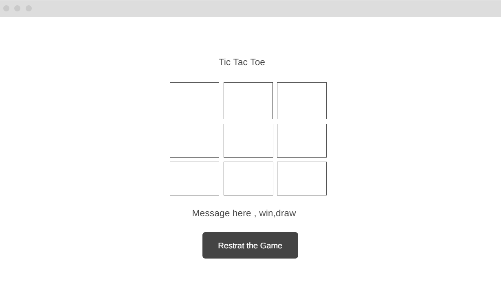

# Design

## Project's Design Overview

The **Tic Tac Toe** game will provide a simple and interactive user interface to play the classic 3x3 grid-based game. The game will alternate turns between two players (X and O), detect wins or draws, and provide a way to reset the game for a new round. The game will be fully responsive and mobile-friendly, ensuring an enjoyable experience for all users.

- **User-Friendly Interface**: A clean, easy-to-navigate 3x3 grid with clear markings for each player's move (X or O).
- **Interactive Gameplay**: Players will alternate turns, with the game automatically detecting wins, draws, and allowing the board to be reset.
- **Accessible Features**: A reset button and a visual indicator showing the current player's turn, ensuring a seamless experience.

The project aims to provide a simple yet fun experience, meeting the expectations of both casual players and enthusiasts of the game. 

## Wireframe(s)

The following wireframe illustrates the basic layout of the Tic Tac Toe game:

## Key Features

1. **3x3 Game Board**: Players click on grid cells to place their X or O. The board will dynamically update with each move.
2. **Turn Indicator**: A display shows whether it is Player X's or Player O's turn.
3. **Game Logic**: Detects if a player has won or if the game has ended in a draw.
4. **Reset Button**: Allows players to start a new game without refreshing the page.
5. **Mobile Responsiveness**: The game layout will adjust automatically to different screen sizes for a smooth experience on both desktop and mobile devices.

## Technologies Used

- **HTML**: For structuring the game layout and elements.
- **CSS**: For styling the game board, buttons, and turn indicators.
- **JavaScript**: For implementing the core game logic, including turn alternation, win/draw detection, and game reset.
- **Jest**: For writing unit tests to ensure proper functionality of the game logic.

## Future Enhancements

- **AI Opponent**: Enable users to play against the computer.
- **Player Name Inputs**: Allow users to enter player names, which will be displayed during gameplay.
- **Score Tracking**: Add a scoreboard to keep track of player wins.